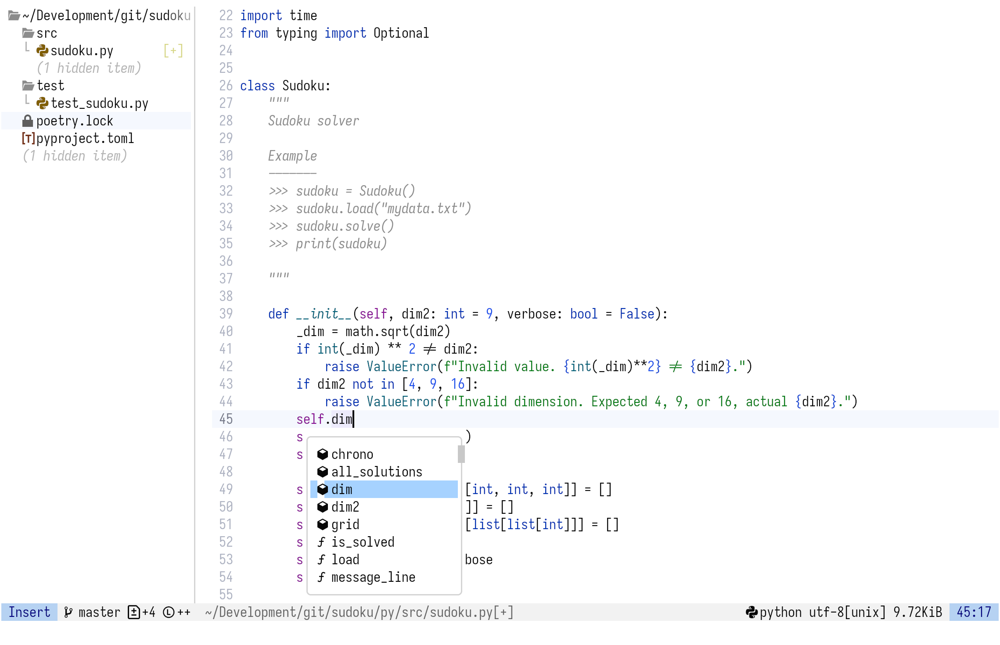

# NVIM color scheme, inspired by IntelliJ Light theme

This is a light color scheme for Neovim, inspired by the IntelliJ Light theme, made in Lua. It aims to provide a clean and readable interface with a focus on syntax highlighting and usability.

|  |
| ----------------------------------------- |

Currently it supports:

- Treesitter syntax highlighting
- LSP diagnostics
- Git signs
- Telescope
- DAP and DAP UI
- Blink
- Which-key

I use it with C, C++, Z80 assembly, Python, Latex, Markdown and JavaScript, but it should work with most languages supported by Treesitter. If you like it and want to contribute, feel free to open an issue or a pull request.
